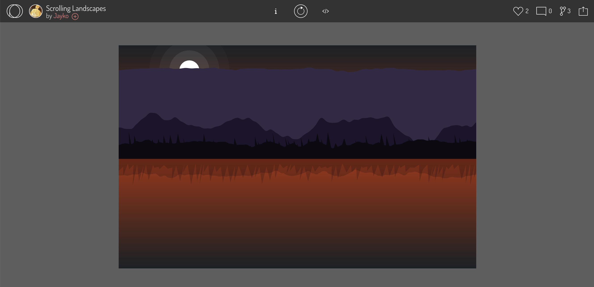
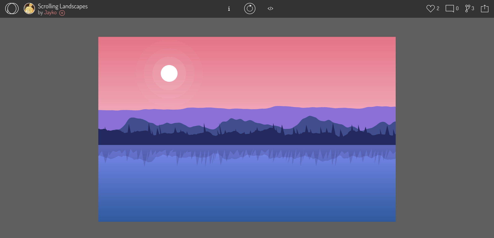
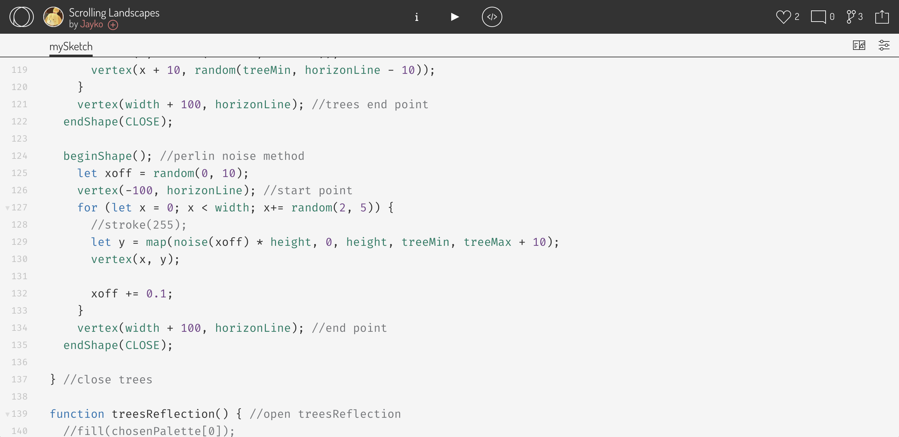
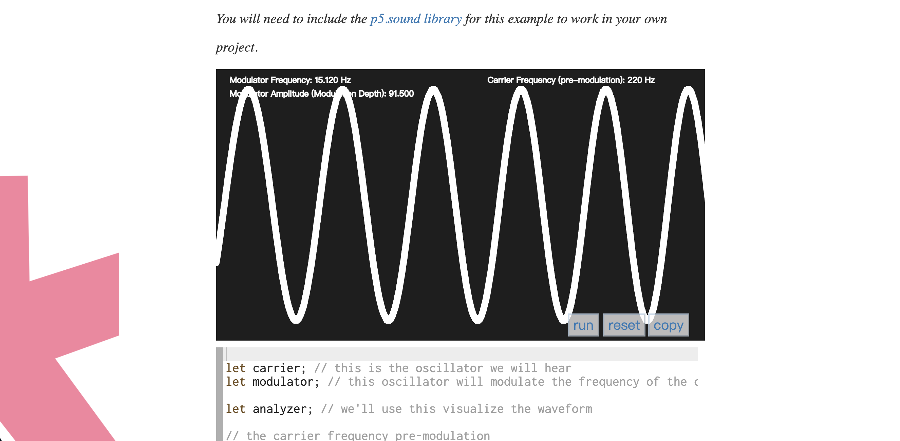
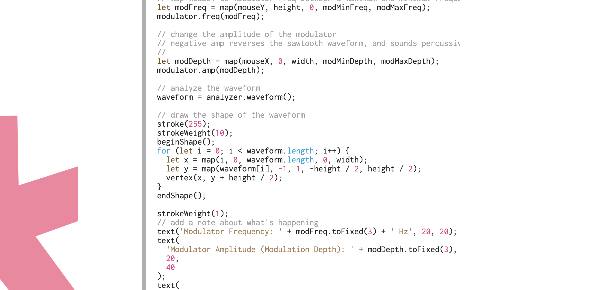

# cwan2220_9103_tut5

# Week 8 Quiz
## Part 1: Imaging Technique Inspiration
### Technique of choice: scrolling landscapes in *Spirited Away*
I was inspired by the moving scenery outside the train window in *Spirited Away*, especially the continuous and smooth landscape changes shown through the **scrolling** technique. This scrolling effect simulates the changes in scenery seen in first-person perspective motion, as if the viewer is sitting in a car admiring the changing scenery outside the window.

### Incorporation in Project
I tend to incorporate **scrolling** techniques into my projects. This will create a dynamic and immersive visual experience for users, enhancing immersion and emotional resonance. It can enhance the ornamental value, storytelling and atmosphere displayed by the pattern, and be consistent with the vision of the project.

### Screenshots of the movie

## Part 2: Coding Technique Exploration
### Explanation of the coding technique
The coding technique found is to use the *p5.js* framework combined with methods such as *Perlin noise* to simulate a scrolling landscape as seen from a moving perspective.

By leveraging *p5.js*, dynamic and continuous rendering of a scene is feasible. The *beginShape()* function as the *Perlin noise* is introduced to depict the natural shapes of elements such as mountains and trees, resulting in enhanced realism over random algorithms. The *push()*, *translate()*, and *scale()* functions are used to realize the reflection of the lake surface. And the overall color and position of elements are randomly generated as it refreshes.

The *p5.js* library is a great help in enabling the use of coding languages and toolkits.

### Screenshots of the coding technique

### Link of the example implementation
[The example implementation and code of Jayko on Openprocessing](https://openprocessing.org/sketch/985476)
[The coding technique on p5.js library](https://p5js.org/examples/sound-frequency-modulation.html)